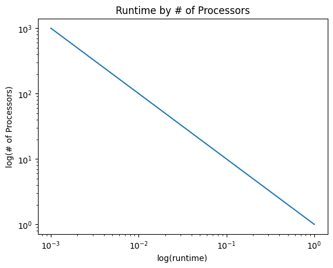
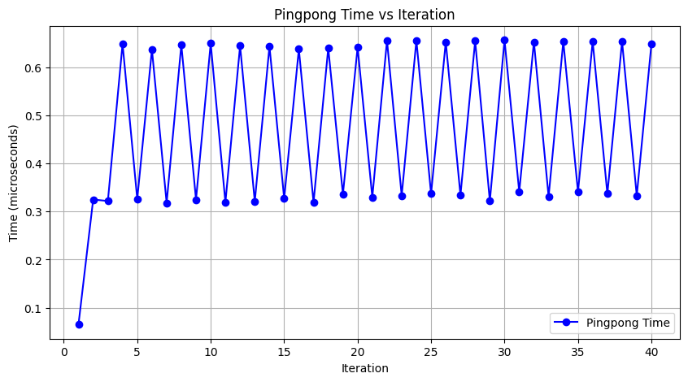
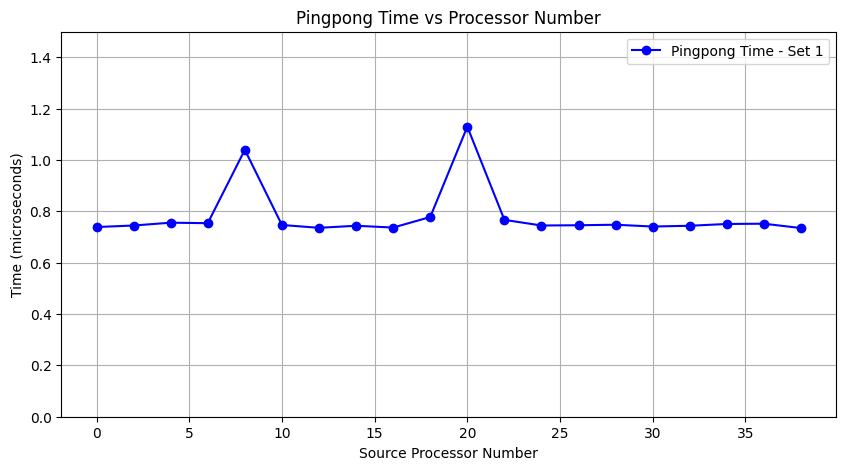
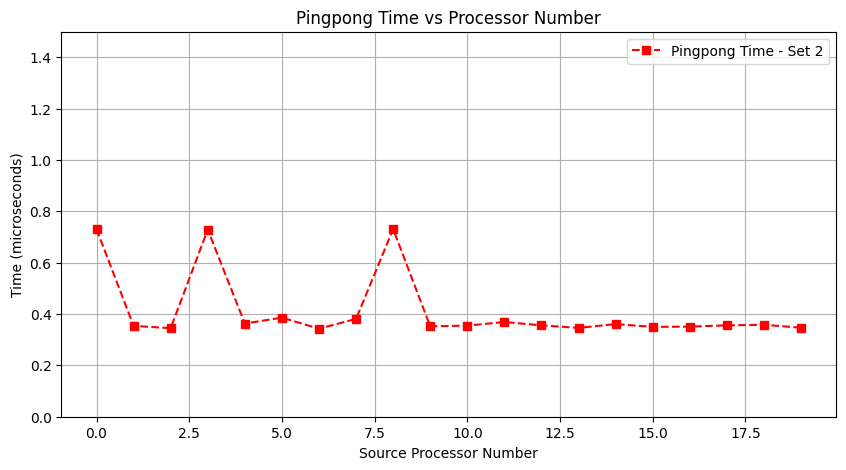

# Homework 2

## Exercise 2.3

*Assume that an addition takes a certain unit time, and that moving a number from one processor to another takes that same unit time. Show that the communication time equals the computation time.*

In this scenario, we have N processors, each of which store 1 number. In each step, half of the processors will send their values to a processor from the other half. That other processor will then add the received value to it's own. The processor that sent it's value is no longer useful. This means that each step, the number of active processors is halved, until there is only one processor left with the total sum. The transport of data and the addition take the same amount of time and are equally involved in every step. So, this will be true when the time taken for each step is summed up.

*Now assume that sending a number from processor $p$ to $p±k$ takes time $k$. Show that the execution time of the parallel algorithm now is of the same order as the sequential time.*

Previously, no matter which processor the data was being moved from or to, the time taken was the same. In this case, however, the time taken is proportional to the distance between the processors. Since each step halves the number of processors, it creates gaps between "adjacent" active processors, doubling the distance (and thus time taken) every step.

The total communication time is then:

$T_{comm}=k(1+2+4+8+...+N/2)=k(N-1)$

The number of steps taken is $log_2(N)$ and an addition happens each step. If the addition also takes $k$ time, then the total time taken for both communication and addition is:

$T_{total}=k(N+log_2(N)-1)$

Code running on a single core would only need to do addition (ignoring memory overhead), so the time taken would be...

$T_{serial}=kN$

## Exercise 2.5

```python
for i in [1:N]:
    x[0,i] = some_function_of(i)
    x[i,0] = some_function_of(i)

for i in [1:N]:
    for j in [1:N]:
        x[i,j] = x[i-1,j]+x[i,j-1]
```

*Answer the following questions about the double i,j loop:*
*1. Are the iterations of the inner loop independent, that is, could they be executed simultaneously?*

No, they are not. They require the value in the previous column (j) to already be computed. So each iteration of the inner loop depends on the result of the previous iteration.

*2. Are the iterations of the outer loop independent?*

No. Similarly, the outer loop requires that the values in the previous row (i) are already computed.

*3. If x[1,1] is known, show that x[2,1] and x[1,2] can be computed independently.*

```python
x[2,1] = x[1,1] + x[2,0]
x[1,2] = x[1,1] + x[0,2]
```

The first loop in the problem code initializes all values at `x[i,0]` and `x[0,i]`, so the values of `x[2,0]` and `x[0,2]` are known. Thus, neither of these computations depend on the values computed by the other. They can be computed independently.

*4. Does this give you an idea for a parallelization strategy?*

Yes. The elements that can be computed independently are diagonals. So, the outer loop could loop over diagonals and the inner loop could be parallelized to compute each element of the diagonal simultaneously.

## Exercise 2.6

*Prove that $𝐸 = 1$ implies that all processors are active all the time. (Hint: suppose all processors finish their work in time $𝑇$, except for one processor in $𝑇′ < 𝑇$. What is $𝑇_𝑝$ in this case? Explore the above relations.)*

If we suppose that all but one processor finishes their work in time $T$ and the other finishing in time $T'$ where $T' \leq T$, $T_p$ is the following:

$$T_p = ((p-1)*T + T')$$

Which gives

$$S_p = \frac{T_1}{((p-1)*T + T')}$$

and

$$E_p = \frac{T_1}{T_pp} = \frac{T_1}{((p-1)*T + T')p}$$

In this case, for $E$ to equal $1$, the following conditions must be met:

* $T' = T$
* $T_1 = T_pp \rightarrow ((p-1)*T + T)p \rightarrow Tp^2$ (the ideal case)

Therefore

$$E_p = \frac{Tp^2}{((p-1)*T + T)p}= \frac{Tp^2}{(p*T)p}=\frac{Tp^2}{(p^2*T)}=\frac{Tp^2}{Tp^2}=1$$

From this, we see that for it to be true that $E=1$, all of the processors must have the same execution time, which is the ideal case as $T_1$ represents ‘the best time to solve the problem on a single processor’. This implies that the processors must all be running and have the same execution time to reach maximum efficiency.

## Exercise 2.10

*Show that, with the scheme for parallel addition just outlined, you can multiply two matrices in $\log_2N$ time with $\frac{𝑁^3}{2}$ processors. What is the resulting efficiency?*

In a matrix-matrix multiplication of matrices with (N x N), each element is can be calculated by the formula:

$(AB)_{ij} = \sum_{k=1}^{m}A_{ik}B_{kj}$  

In this, we can see that each element of the resulting matrix $(AB)$ is independent of any other element in $(AB)$, and as such could be handled as one of $N^2$ parallel operations.

Furthermore, each individual operation is essentially a sum of elements, and could therefore be handled by the same parallel summation algorithm as described in the textbook:

1. Define $s^{(0)}_k = A_{ik}B_{kj}$.
2. Iterate with $l = 1, 2, ... \log_2(N)$
3. Compute $\frac{N}{2^l}$ partial sums: $s^{(l)}_{k} = s^{(l-1)}_{2k} + s^{(l-2)}_{2k+1}$

This operation has a known time of $\log_2 N$ when performed using $\frac{N}{2}$ processors. If we provide each of our $N^2$ matrix elements with $\frac{N}{2}$ processors to perform this sum, we get the expected value of $\frac{N^3}{2}$ processors. If we then assume that there are no startup or discretization costs, then the overall multiplication only takes as long as each operation, so the overall multiplication inherits the $\log_2 N$ time.

To determine the efficiency of this, we will start by finding the speedup. For the serial version of this function, we would need to perform the sum for every element in the result matrix, resulting in a time of $N^3$. We determined above that the time of the parallel version is $\log_2N$.
  
$S_p = \frac{T_s}{T_p} = \frac{N^3}{\log_2{N}}$

From this, we can find the efficiency, where $p$ is the number of processors:  

$E = \frac{S_p}{p} = \frac{N^3}{\log_2N}(\frac{2}{N^3}) = \frac{2}{\log_2N}$  

$$ E = \frac{2}{\log_2N}$$

## Exercise 2.11

*Let’s do a specific example. Assume that a code has a setup that takes 1 second and a parallelizable section that takes 1000 seconds on one processor. What are the speedup and efficiency if the code is executed with 100 processors? What are they for 500 processors? Express your answer to at most two significant digits.*

First, we can derive equations for the Speedup and Efficiency, given Amidahl's law.

$T_p = T_1\left(F_s + \frac{F_p}{p}\right)$

$S_p = \frac{T_1}{T_p}=T_1\left[T_1\left(F_s + \frac{F_p}{p}\right)\right]^{-1}$

$S_p = \left(F_s + \frac{F_p}{p}\right)^{-1}$

$E = \frac{S_p}{p}$

From here, we can then calculate both, given the provided values:

$F_s = 1 / 1001, F_p = 1000/1001$

$F_s(100) = \left(\frac{1}{1001} + \frac{1000}{1001 * 100}\right)^{-1} = 91$

$E(100) = 91 / 100 = .91$

$F_s(500) = \left(\frac{1}{1001} + \frac{1000}{1001 * 500}\right)^{-1} = 333.67$

$E(500) = 333.67 / 500 = .6673$

We found:
$$\begin{align}
S(100) = 91 \\
E(100) = .91 \\
S(500) = 333.67 \\
E(500) = .6673
\end{align}$$

## Exercise 2.12

*Investigate the implications of Amdahl’s law: if the number of processors 𝑃 increases, how does the parallel fraction of a code have to increase to maintain a fixed efficiency?*

First, we can derive equations for the Speedup and Efficiency, given Amidahl's law.

$S_p = \frac{T_1}{T_p}, T_p = T_1(F_s + \frac{F_p}{p})$

$S_p = T_1[T_1(F_s + \frac{F_p}{p})]^{-1}$

$S_p = (F_s + \frac{F_p}{p})^{-1}$

$E = \frac{S_p}{p} = (pF_s + F_p)^{-1} = (p(1-F_p) +F_p)^{-1}$

Now, we will want to find an equation for $F_p$ that satisfies the following:

$\frac{d}{dp}E = 0$

In order for this to be true, we must find that:

$\frac{d}{dp}(p(1-F_p) + F_p) = 0$

$F_p'(1-p) - F_p + 1 = 0$

Rearranging, we can find:

$F_p = F_p'(1-p) + 1$

$F_p = \frac{dF_p}{dp}(1-p)+1$

$-\frac{F_p - 1}{p-1} = \frac{dF_p}{dp}$

$-\frac{dF_p}{F_p-1} = \frac{dp}{p-1}$

We can then integrate:

$-\int\frac{1}{F_p-1}dF_p = \int\frac{1}{p-1}dp$

$-\ln(F_p-1) + C = \ln(p-1) + C$

$\ln(F_p-1) = C - \ln(p-1)$

$F_p-1 = \frac{e^C}{p-1}$

$F_p = \frac{C}{p-1}+1$

We find the final relationship:

$$F_p = -\frac{C}{p-1}+1, \  F_s = \frac{C}{p-1}$$

Where C is some positive constant that controls the target efficiency. This relationship is only valid when $p \ge C + 1$ and $p > 1$.

Under this relationship, the Efficiency of this system remains constant as the number of processors increases. The general behavior indicates that, as the number of processors increases, the parallel fraction needs to asymptotically approach 100% in order for the efficiency to remain constant.

Along the same lines, the operating term $\frac{C}{p-1}$ represents the influence of the Sequential Fraction, whose effect is magnified as the number of processors increases, and must asymptotically approach 0% for the efficiency to remain constant.

## Exercise 2.17

*We can formulate strong scaling as a runtime that is inversely proportional to the number of processors: $𝑡 = 𝑐/𝑝$*

*Show that on a log-log plot, that is, you plot the logarithm of the runtime against the logarithm of the number of processors, you will get a straight line with slope $−1$. Can you suggest a way of dealing with a non-parallelizable section, that is, with a runtime $𝑡 = 𝑐 + 𝑐2/𝑝$?*

Below is code that plots runtime versus the number of processors on a logarithmic scale. You can see that the slope of this line is $-1$.

``` Python
import numpy as np
import matplotlib.pyplot as plt

p = np.arange(1,1000)
t = 1/p # c is a constant (here = 1)

plt.loglog(t,p)
plt.title("Runtime by # of Processors")
plt.xlabel("log(runtime)")
plt.ylabel("log(# of Processors)");
```



To deal with non-parallelizable section with a runtime $𝑡 = 𝑐 + 𝑐2/𝑝$, be sure to increase the number of processors $p$ as much as possible. Since one part is not parallelizable ($c$), to reduce runtime as much as possible, increasing $p$ minimizes the runtime for the parallelizable part of the code. Therefore, the only limiting factor would be the non-parallelizable code.

## Exercise 2.19

*In the above discussion we always implicitly compared a sequential algorithm and the parallel form of that same algorithm. However, in section 2.2.1 we noted that sometimes speedup is defined as a comparison of a parallel algorithm with the best sequential algorithm for the same problem. With that in mind, compare a parallel sorting algorithm with runtime $(log\ n)^2$ (for instance, bitonic sort; section 9.6) to the best serial algorithm, which has a running time of $n\ log\ n$.*

*Show that in the weak scaling case of $n=p$ speedup is $p/log\ p$. Show that in the strong scaling case speedup is a descending function of $n$.*

For this problem, assume the algorithm has a runtime of $n\log n$ using the best serial algorithm and a runtime of $(\log n)^2$ using a parallel algorithm.

In the weak scaling case where $n=p$, speedup is
$$\frac{T_1}{T_p} = \frac{n\log n}{(\log n)^2} = \frac{n}{\log n} = \frac{p}{\log p}$$

In the strong scaling case, $T_p = (\log n)^2 \cdot \frac{c}{p}$ for a constant $c$ since the time decreases linearly as we increase the processor count.

Then, speedup is
$$\frac{T_1}{T_p} = \frac{n\log n}{(\log n)^2 \cdot \frac{c}{p}} = \frac{pn}{c\log n}$$

Thus, leaving $n$ constant and increasing $p$ will linearly increase the speedup. If instead we fix $p$ then speedup scales like $\frac{n}{\log n}$ which increases with $n$.

## Exercise 4.1
*Implement the ping-pong program. Implementation can be found on `4_1/main.cpp`.*

In order to test the communication time with different distances of processors different source and targets. The source is always process 0, and the target is always `nprocs - 1` (i.e. the last process). The results can be seen on the image below.



A clear pattern of increasing and decreasing time can be seen with each change in the target process. Initially it might not seem correct why this is the case.

One possible scenario is that MPI does not allocate processes in order – it gets a specified number of cores, using 2 as an example, and allocates several processes on these cores. When the two ping-pong processes are allocated on the same core, then the time is shorter, when they are alocatted on different cores, the communication time is longer. A possible "solution" would be to use MPI configuration to algin the processes on the cores in order, for example processes from 0-10 in core 1, and 11-20 in core 2.

## Exercise 4.2

*Take your pingpong program and modify it to let half the processors be source and the other half the targets. Does the pingpong time increase? Does the observed behavior depend on how you choose the two sets?*

For this exercise we chose two sets of source/target combinations.

**Set 1:** Processes communicate with adjascent processes.
Example with 10 processes:

    0 <-> 1
    2 <-> 3
    4 <-> 5
    6 <-> 7
    8 <-> 9

**Set 2:** Processes communicate with processes with a distance of `nprocs / 2`
Example with 10 processes:

    0 <-> 5
    1 <-> 6
    2 <-> 7
    3 <-> 8
    4 <-> 9

For Set 1 it was observed an average time of `0.78175 microsec`.

For Set 2 it was observed an average time of `0.41319 microsec`, consistently faster compared to Set 1.

The exact reason for such difference in timing is hard to pinpoint. It could be a similar scenario to the one explained on 4.1, where even if the process number is farther apart, the physical processes are closer, and thus faster to each other, depending on how MPI allocates them.

In both sets it can also be noticed that there are some peaks on pingpong time. A possible reason is that for that combination the processes are on different nodes, increasing the latency to send signals, while on other combinations they are in the same node, decreasing the latency.

The detailed times for each source-target combination can be seen on the plots below:





## Exercise 4.13

*Now use nonblocking send/receive routines to implement the three-point averaging operation*

$$y_i=(x_{i-1}+x_i+x_{i+1})/3\ :\ i=1,...,N-1$$

*on a distributed array. There are two approaches to the first and last process:*
1. *you can use MPI_PROC_NULL for the ‘missing’ communications;*
2. *you can skip these communications altogether, but now you have to count the
requests carefully*

The starter code `isendirecv.cxx` was modified to implement an MPI code which uses non-blocking communication at process $i$ to send and receive the process number to and from processes $i-1$ and $i+1$.

For the boundary processes (processes $0$ and $procno-1$), `MPI_PROC_NULL` was used to indicate sending and receiving need not occur.

The variable `mydata` contains the data we wish to send, and the following code posts a send and receive to the "left side" process:
```cpp
MPI_Isend(&mydata,1,MPI_DOUBLE, sendto,0, comm, requests);
MPI_Irecv(&leftdata,1,MPI_DOUBLE, recvfrom,0, comm, requests + 1);
```

The communication with the right side is symmetric to this.

Then, we must use the following code to wait on the 4 requests to finish:
```cpp
MPI_Waitall(4, requests, MPI_STATUSES_IGNORE);
```

Since the communication is non-blocking, until this wait is done we cannot be sure that `leftdata` and `rightdata` actually contain the data.

## Exercise 4.14

*Take your code of exercise 4.13 and modify it to use latency hiding. Operations that can be performed without needing data from neighbors should be performed in between the MPI_Isend / MPI_Irecv calls and the corresponding MPI_Wait calls.*

For this exercise the starter code `isendirecvarray.cxx` was modified to implement an MPI code which uses non-blocking communication in a similar fashion to the previous exercise.

The key difference is that now each process has an array of 100 elements to compute the 3-point average of, only 2 of which (first and last) require neighboring processes' data to compute. Thus, we have some work which can be done while waiting on the requests.

First, we post the sends and receives for each process to send their first and last element and receive the neighboring element they need. While waiting on those requests, we can finish constructing the rest of the array and compute the 3 point average for the inner elements:

```cpp
for (int i=0; i<mylocal; i++)
    indata[i] = myfirst+i;

for (int i=1; i<mylocal-1; i++)
    outdata[i] = indata[i-1] + indata[i] + indata[i+1];
```

Afterwards, we can call `MPI_Waitall` similarly to the previous exercise.

This is called latency hiding, since we perform necessary work while the non-blocking communication requests complete. Ideally, we will spend less time blocking on the `MPI_Waitall` call than if all those computations were done before or after posting the requests.


