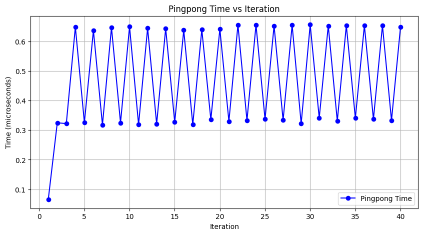
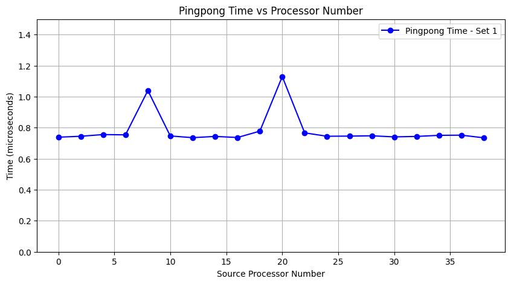
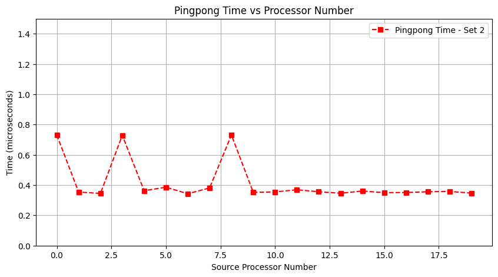

# Homework 2

## Exercise 4.1
> Implement the ping-pong program. 
Implementation can be found on `4_1/main.cpp`.

In order to test the communication time with different distances of processors different source and targets.
The source is always process 0, and the target is always `nprocs - 1` (i.e. the last process).
The results can be seen on the image bellow.

A clear pattern of increasing and decreasing time can be seen with each change in the target process. A possible reason is that when communicating from process `0<->4` they are 4 cores apart, making for simpler messaging. However when communicating processes `0<->5` there is an odd number of cores apart, and therefore communication can be farther apart.

## Exercise 4.2
> Take your pingpong program and modify it to let half the processors be source and the other half the targets. Does the pingpong time increase? Does the observed behavior depend on how you choose the two sets?

For this exercise we chose two sets of source/target combinations.

Set1: Processes communicate with adjascent processes.
Example with 10 processes:
    
    0 <-> 1
    2 <-> 3
    4 <-> 5
    6 <-> 7
    8 <-> 9

Set 2: Processes communicate with processes with a distance of `nprocs / 2`
Example with 10 processes:

    0 <-> 5
    1 <-> 6
    2 <-> 7
    3 <-> 8
    4 <-> 9

For Set1 it was observed an average time of `0.78175 microsec`. 

For Set2 it was observed an average time of `0.41319 microsec`, consistently faster compared to Set1.

In both sets it can also be noticed that there are some peaks on pingpong time. A possible reason is that for that combination the processes are on different nodes, increasing the latency to send signals, while on other combinations they are in the same node, decreasing the latency.

The detailed times for each source - target combination can be seen on the plots:

