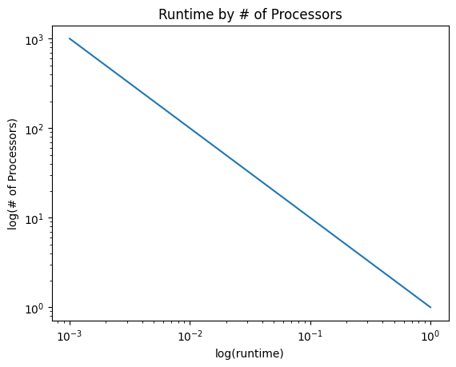

## Exercise 2.17

We can formulate strong scaling as a runtime that is inversely proportional to the number of processors:

$$𝑡 = 𝑐/𝑝$$

Show that on a log-log plot, that is, you plot the logarithm of the runtime against the logarithm of the number of processors, you will get a straight line with slope $−1$. Can you suggest a way of dealing with a non-parallelizable section, that is, with a runtime $𝑡 = 𝑐 + 𝑐2/𝑝$?

Below is code that plots runtime versus the number of processors on a logarithmic scale. You can see that the slope of this line is $-1$. 

``` Python
import numpy as np
import matplotlib.pyplot as plt

p = np.arange(1,1000)
t = 1/p # c is a constant (here = 1)

plt.loglog(t,p)
plt.title("Runtime by # of Processors")
plt.xlabel("log(runtime)")
plt.ylabel("log(# of Processors)");
```



To deal with non-parallelizable section with a runtime $𝑡 = 𝑐 + 𝑐2/𝑝$, be sure to increase the number of processors $p$ as much as possible. Since one part is not parallelizable ($c$), to reduce runtime as much as possible, increasing $p$ minimizes the runtime for the parallelizable part of the code. Therefore, the only limiting factor would be the non-parallelizable code. 