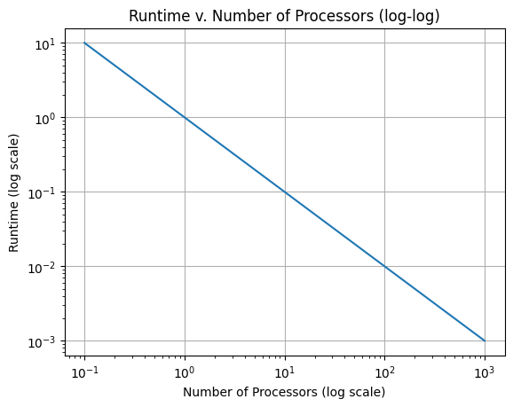

# CMSE 822 Homework 2 Report

## Exercise 2.3

(i) For addition using parallel processors, the time it takes to compute is $ \frac{n}{p} * O(f)$ (where $O(f)$ is dependent on the efficiency of the specified function). The number of operations performed that must be communicated is $n* O(f)$. Processors follow a structured reduction pattern, so the time it takes reduces with each new processor since processors compute partial results and communication can be parallelized, similar to computation. This means that the communication time will also be $ \frac{n}{p} * O(f)$.

(ii) If the time to communicate from processor $p$ to $p \pm k$ now takes time $k$, this changes the order of the time algorithm. In the worst case, every communication takes place between two processors that are the farthest possible distance away, so $k = p$ in every case and therefore the communication time becomes $O(p)$. This changes the time algorithm to $ \frac{n}{p}*O(f) + O(p)$. If $p$ becomes large then $O(p)$ can dominate which changes the time to $n*O(f)$, the same as sequential time. 

## Exercise 2.5

```python
for i in [1:N]:
    x[0, i] = some_function_of(i)
    x[i, 0] = some_function_of(i)

for i in [1:N]:
    for j in [1:N]:
        x[i, j] = x[i-1, j] + x[i, j-1]
```

We are required to answer the following questions about the double ```i,j``` loop:
1. Are the iterations of the inner loop independent, that is, could they be executed simultaneously?
      We notice that the inner loop of the algorithm is desgined to update ```x[i,j]``` by using the equation ```x[i, j] = x[i-1, j] + x[i, j-1]``` where;
           ```x[i-1, j]``` represents the rows and
           ```x[i, j-1]``` represents the columns.
     From this design, we notice that the iteration of the inner loop depends on the previous row and the previous column. This implies that the iterations of the innerloop
      are not independent and therefore cannot be executed simultaneously.
   
2. Are the iterations of the outer loop independent?
         We observed that outer loop iterates over ```i``` and for every iteration on the algorithm and  ```i``` depends on the previous row denoted as ```x[i-j]```.
       This implies that iterations of the outerloop are not indepedent. 

     
3. If ```x[1,1]``` is known, show that ```x[2,1]``` and ```x[1,2]``` can be computed independently.
          We know that ```x[i, j] = x[i-1, j] + x[i, j-1]```
       This implies that;
             ```x[2, 1] = x[1, 1] + x[2, o]```                (1)
        and
           ```x[1, 2] = x[0, 2] + x[1, 1]```                  (2)
       We observe that in both equations (1) and (2), there is ```x[1,1]``` on the right hand side in the the diagonal.
       We also observed that there is ```x[2,0]``` and ```x[0,2]``` in equation (1) and (2) respectively.
       This implies that in each case that is, case (1), ```x[2,0]``` is computed first before updating ```x[2,1]``` and
       similary in case (2), ```x[0,2]``` is computed first before updating ```x[1,2].```
       This therefore means that if ```x[1,1]``` is known, then both ```x[2,1]``` and ```x[1,2]``` can be computed independently.
               
       
4. Does this give you an idea for a parallelization strategy?
        Yes, this gives us an idea of a parallelization strategy. From part (3) above, there is an interesting observation of computing the diagonal elements first
       and then compute ```x[2,1]``` and ```x[1,2]``` can be computed independently in parallel. By doing this, we are solving the algorithm by using wavefronts as
        discussed in section 7.10.1 page 333 textbook of the lecture notes. We notice that the values of each wavefront are independent so they can be solved in
         parallel in the same sequential step. Starting with the diagonal elements avoids dependencies and hence allowing parallelization.

## Exercise 2.6

We are required to prove that ```𝐸 = 1``` implies that all processors are active all the time.
(Hint: suppose all processors finish their work in time ```𝑇,``` except for one processor in
```𝑇' < 𝑇``` . What is ```𝑇_𝑝``` in this case? Explore the above relations.)

  From section 2.2.1.1 (Speedup and efficiency) page 62 Textbook of the lecture notes, 
    Let 
        ```p``` be the processors, 
        ```T_1``` the execution time on a single processor and 
        ```T_p``` the time on the ```p``` processors
        the speed up ```sp = T_1/T_P```
    in the ideal case, ```T_p = T_1/p```  but in practice, we dont expect to obtain that, 
    so ```sp ≤ p.``` To measure how far we are from the ideal speedup, we introduce the
    efficiency ```E_p = S_p/p.``` Clearly, ```0  ≤ E_p ≤ 1.```

  From the given information, this implies that;
          ```E_p = T_1/pT_p```
  Suppose that ```E=E_p=1```, then this implies that ```T_P = T_1/p``` which is exactly the parallel execution time in the ideal case 
  as we saw in the definition in the textbook. This means that all the processors are fully utilized at that time. 

  However, we know that in practice, we cannot attain that, so ```S_p ≤ p.```  we introduce the
    efficiency ```E_p = S_p/p.``` Clearly, ```0  ≤ E_p ≤ 1.```. This implies that ```0  ≤ S_p/p ≤ 1 ``` and hence ```0  ≤ T_1/T ≤ 1.``` This 
    contradicts the statement that ```𝐸 = 1``` implies that all processors are active all the time. This therefore means that if a processor were idle
    at that time, then the efficiency ```E_p``` would be less less than one. 

  This completes the proof. 

## Exercise 2.10

Normally multiplyong matricies is a O(n^2) computation becasue each n represents the size of a matrix which needs ot be iterated through. using parallel addition to sum n numbers we now know the speed is O(log2(n)) woth O(n/2) processors. we need to use each o the n^2 element in the matrix which we can do becaue because the summations are being asssumed to the total numer of processors required. because instead of the sumation taking place between n and n one of them is O(log2N) because as seen in the cell under this we gather this information form the efficiency equation which is time parallel time * number of processor, which in this case is:

    E = n^3 / (n^(3/2) * log2N ) 

so the multiplication used in log2N and is usd to being the gather the exact efficiency equation. 

This confirms that while speeding the parallel scheme becomes less efficient for the very large skall of N. and confirms the resulting efficiency of the calculation. 

## Exercise 2.11

Let’s do a specific example. Assume that a code has a setup that takes 1 second and a parallelizable section
that takes ```1000``` seconds on one processor. What are the speedup and efficiency if the code is executed with 
```100``` processors? What are they for ```500``` processors? Express your answer to at most two significant digits.


From section 2.2.3 (Amdahl’s law) page 65 Textbook of the Lecture notes, we know that, 
      ```𝐹_𝑝 + 𝐹_𝑠 = 1.```                   (1)
where;
      ```𝐹_𝑠``` is the sequential fraction of a code and 
      ```𝐹_𝑝``` is the parallel fraction (or more strictly: the ‘parallelizable’ fraction) of a code
      
The parallel execution time ```𝑇_𝑝``` on ```𝑝``` processors is given by;
      ```𝑇_𝑃 = 𝑇_1 (𝐹_𝑠 + 𝐹_𝑝/𝑃 ).```        (2) 
where;
      ```𝑇_1F_s``` is the part that is sequential and 
      ```T_1F_p/p``` is the  the part that can be parallelized
      

Casse 1: For ```100``` processors
From equation (2), we can write that; 
      ```T_p = 1 + 1000 = 1001``` seconds 
But from equation (1), we can write that;
      ```F_p = (1-F_s)```                    (3)
Substituting ```T_P``` and equation (3) into equation (2) gives us;
    ```1001 = T_1(F_s + (1-F_s)/100)```       (4)
But we are told that the set up takes 1 second meaning that  ```𝑇_1F_s = 1.``` This implies that  ```𝑇_1 = 1/F_s.```
Substituting for ```T_1``` in equation (4) gives us;
    ```1001 =  1/F_s (F_s + (1-F_s)/100)```    (5)
    ```1001F_s = (F_s + (1-F_s)/100)``` 
    ```100100F_s = 100F_s + 1 - F_s```
    ```100001F_s = 1```
    ```F_s = 0.0000.9999```
Therefore the speedup, ```S_p = T_1/p = (1/F_s)/p = 100001/100 = 1000.01```
The Efficiency, ```E_p = S_p/p = 1000.01/100 = 10.0001```

Case 2: For ```500``` processors
The speedup, ```S_p = T_1/p = 100001/500 = 200.002```
The Efficiency, ```E_p = S_p/p = 200.02/500 = 0.400004```

## Exercise 2.12

The impact of increasing the number of processors or P is that E(P) is defined by the ratio at which the number of processors speed up, becasue E(P) must remain constant. so this requires an increase in f or the parallilizable fraction of th code.

So for efficency to remain fixed the paralliziable portion of the code much reach 100% as P grows.

## Exercise 2.17

```python
import matplotlib.pyplot as plt
import numpy as np

# Generate sample data
p = np.linspace(0,1000, 10000)
p = p[p != 0]
t = 1/p

# Create the plot with log scaling on both axes
plt.loglog(p, t)

# Add labels and title
plt.xlabel('Number of Processors (log scale)')
plt.ylabel('Runtime (log scale)')
plt.title('Runtime v. Number of Processors (log-log)')

# Display the plot
plt.grid(True)
plt.show()
```



This clearly demonstrates that on a log scale, the runtime v. processors has a slope of -1. 

If there is a non-parallelizable portion of the problem ($t = c_1 + \frac{c_2}{p}$) then the sequential portion can be optimized to the fullest to reduce the runtime bottleneck it produces. This can mean either increasing the efficiency of the algorithm or parallelizing every part of the sequential portion until the minimum possible amount has to be perfomed sequentially. 

## Exercise 2.19

The bitonic sort also has a run time of about O((logn)^2) and the best case is O(nlogn) in the worst case it is (logp)^2

If p was fixed and n started to increase the net runtime grows as much as nlog(n) which increases the parallel runtime to log(n)^2

This decrease as n grows makes the speedup drop within the function of n.

## Exercise 4.1

### [Exercise 4.1 Code](https://github.com/cmse822/ss25-fellowship/blob/main/homework/homework2/exercise4_1.cpp)

## Exercise 4.2

### [Exercise 4.2 Code](https://github.com/cmse822/ss25-fellowship/blob/main/homework/homework2/exercise4_1.cpp)

## Exercise 4.13

### [Exercise 4.13 Code](https://github.com/cmse822/ss25-fellowship/blob/main/homework/homework2/exercise4_1.cpp)

## Exercise 4.14

### [Exercise 4.14 Code](https://github.com/cmse822/ss25-fellowship/blob/main/homework/homework2/exercise4_1.cpp)