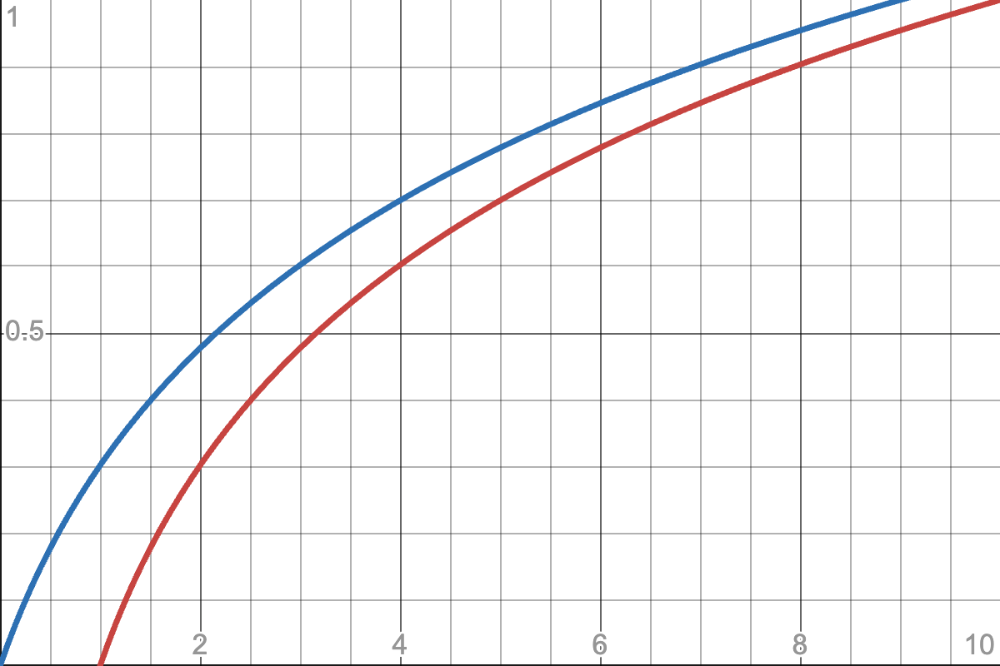

# Solutions

**Team**: Thread Titans

**Team Members**: Alex, Bashar, Fizza, Maya, Ramin

## Exercise 2.3

Assume that an addition takes a certain unit time, and that moving a number from one processor to another takes that same unit time. Show that the communication time equals the computation time. 

Now assume that sending a number from processor $p$ to $p \pm k$ takes time $k$. Show that the execution time of the parallel algorithm now is of the same order as the sequential time.

Answer:

## Exercise 2.5

Answer

## Exercise 2.6

Answer

## Exercise 2.10

Answer

## Exercise 2.11

Answer

## Exercise 2.12

Answer

## Exercise 2.17

For the strong scaling, run-time is given as 
$$t = \frac{c}{p} \to \log{t} = \log{c} - \log{p}$$
Now if we consider $\log{p}\to x$ and $\log{t} \to y$ as the variables :
$$y = \log{c} - x$$
which is a line with the slop of $-1$.

Next, if run-time has non-parallelizable part :
$$t = c_s + \frac{c_p}{p} \;\to\; \log{t} = \log{c_s}+\log{\big(1+\frac{c_p}{p\times c_s}\big)} \;\xrightarrow{c^* = \frac{c_p}{c_s}}\;   \log{t} = \log{c_p}-\log{c^*}+\log{\big(1+\frac{c^*}{p}\big)}$$
where $c_s$ and $c_p$ denote the non-parallelizable and parallelizable portion respectively. $c^*$ is the ratio of parallelizable to non-parallelizable part.  Here, our goal is to derive a similar expression as above under a certain assumption. Let us compare  $\log{\big(1+x\big)}$ (blue) and $\log{x}$ (red) :

    

We observe, if $x$ is large enough we almost have $\log{\big(1+x\big)} \approx \log{x}$. So we can assume if $c^*$ is large enough :
$$\log{t} \approx  \log{c_p}-\log{c^*} - \log{p}+\log{c^*} \approx  \log{c_p} - \log{p}$$
We can conclude that if the computational cost of the serial part of the problem is significantly smaller compared to the parallelizable part, we can almost expect the same scaling behavior. This can be achieved by optimizing the code to reduce the computational cost of the serial part or by increasing the problem size to increase the computational cost of the parallelizable part. Additionally, we can explore different parallel schemes that can further reduce the computational cost of the serial part.

## Exercise 2.19

For weak scaling if given that $n=p$ :
$$\textrm{speed-up} = \frac{p\log{p}}{(\log{p})^2} = \frac{p}{\log{p}}$$

For strong scaling the size of problem is fixed and number of processor is $p$. For bitonic sort we know $\Theta(n,p)=\dfrac{n(\log{n})^2}{p}$
$$\textrm{speed-up} = \frac{n\log{n}}{n\log{n}^2/p} = \frac{p}{\log{n}}$$
Which is a decreasing function of $n$.

## Exercise 4.1

Answer

## Exercise 4.2

Answer

## Exercise 4.13

Answer

## Exercise 4.14

Answer