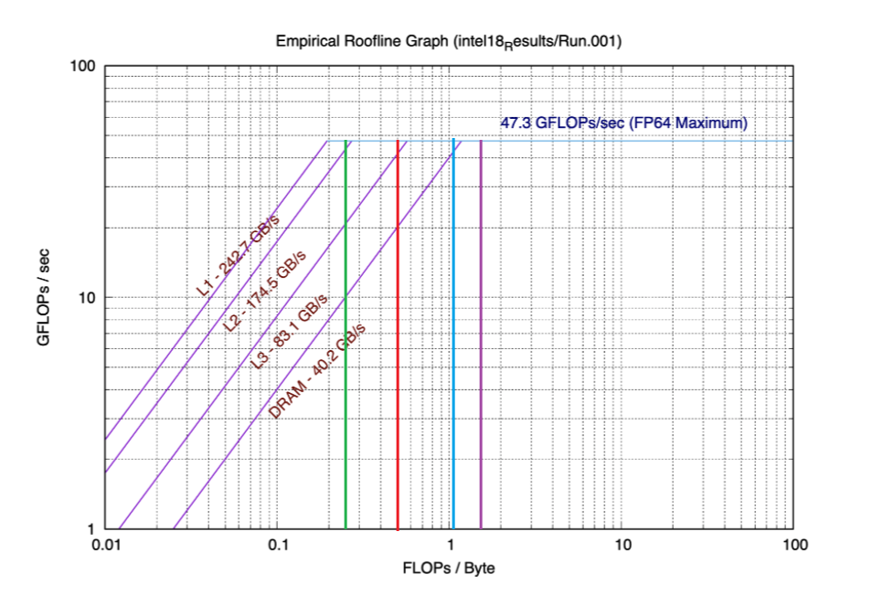
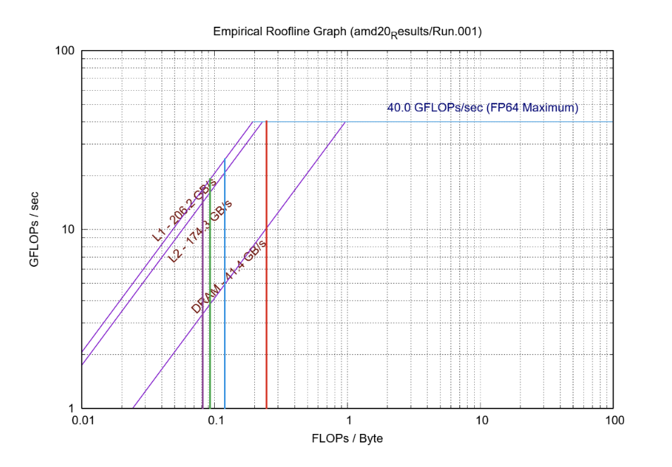

# Project 1: The Path to Peak Performance

## Warm Up: Calculating Arithmetic Intensities

The arithmetic intensity of a kernel is the number of operations done on its data divided by the number of bytes of data being accessed during the calculation. In each of the below calculations, it is assumed that each floating point value takes up 8 bytes of data.

| Kernel Operation                 | Arithmetic Intensity        | Notes                                                                                          |
|-----------------------------------|----------------------------|------------------------------------------------------------------------------------------------|
| `Y[j] += Y[j] + A[j][i] * B[i]`  | $3/32=0.09375$             | There are three loads, one store, and 3 FLOPS.                                                 |
| `s += A[i] * A[i]`               | $2/8=0.25$                 | The variable 's' can be kept in the accumulator register so that it is only written to at the end of the loop. So, there is only one load, no stores, and 2 FLOPS. |
| `s += A[i] * B[i]`               | $2/16=0.125$                | Similar to the previous kernel, except it requires two data loads.                             |
| `Y[i] = A[i] + C*B[i]`           | $2/24\approx0.0833$        | 'C' is a constant which can be kept in register. So, there are two data loads, one store, and two FLOPS. |

## Part 1: The Roofline Model

### Running the ERT in serial mode
We ran the `ert toolkit` on the following `intel-16`, `intel-18` and `amd-20` nodes using base configurations. The following plots are the results of these tests.

Using these plots, for each of the nodes we determined the bandwidth and ridge for each cache, as well the peak performance. These values are recorded in the table below.

| Metric               | AMD 20 | Intel 16 | Intel 18 |
| ---                  | ---    | ---      | ---      |
| Peak Perf (GFLOPS/s) | 40.0   | 31.4     | 47.3     |
| L1 Bandwidth (GB/s)  | 206.2  | 172.4    | 242.7    |
| L2 Bandwidth (GB/s)  | 174.3  | 113.5    | 174.5    |
| L3 Bandwidth (GB/s)  | -   | 71.2     | 83.1     |
| L1 Ridge             | ~0.2   | ~0.2     | ~0.2     |
| L2 Ridge             | ~0.4   | ~0.3     | ~0.3     |
| L3 Ridge             | -     | ~0.4     | ~0.6     |

### Predicting performance of floating-point kernel on each node

The four floating-point kernels from "Roofline: An Insightful Visual..." are SpMV, LBMHD, Stencil, and 3-D FFT. For each of these kernels, we analyzed the performance on both the Intell18 and AMD20 nodes.

In both of the below plots, the colors correspond to the following kernels:
* **Green:** SpMV
* **Red:** LBMHD
* **Blue:** Stencil
* **Purple:** 3-D FFT

__SpMV__ hits peak performance for L1 only, this kernel would have mediocre performance on this system since it is unlikely for the problem to fit entirely in L1. It hits the L2 roofline close to peak performance, but if the problem is big enough to require L3 it would take a performance hit of around 20 GLOPS/sec.

__LBMHD__ hits peak performance for L2, so this kernel would perform better. If L3 is required a small performance hit would be suffered but if DRAM is required it will take another large decrease of around 20 GFLOPS/sec.

__Stencil__ hits peak performance for L3, so this kernel would perform well. If DRAM is required there will be roughly a 5 GFLOPS/sec performance decrease, but this is manageable.

__3-D FFT__ has a high enough arithmetic intensity to hit peak performance on this system for all levels of memory. The only thing to be careful of in this case is page faults.

Looking at the AMD system, we see a similar story. The main differences are
- __SpMV__ hits peak performance for L2 cache on this system.
- L3 cache is not captured on this system.
- __Stencil__ hits peak performance for DRAM on this system.

It is also worth noting that the peak performance on the AMD20 is about 7 GFLOPs/sec slower than the Intel18.

### Roofline of Warmup Kernels

Now, we perform the same analysis on these nodes for the kernels from arithmetic intensity calculations. 

In both of the plots below, the colors of each vertical line correspond to these kernel operations:
* **Green:** `Y[j] += Y[j] + A[j][i] * B[i]`
* **Red:** `s += A[i] * A[i]`
* **Blue:** `s += A[i] * B[i]`
* **Purple:** `Y[i] = A[i] + C*B[i]`

__Kernels 1, 3, and 4__ all fail to hit peak performance on any memory level due to having relatively low arithmetic intensities. Thus, they will all perform relatively poorly because they will not be able to make use of the available bandwidth. For instance, __Kernel 4__ has the worst performance hitting the L1 roofline at around 20 GFLOPs/sec and the DRAM roofline as low as around 3 GFLOPS/sec. The best of these three, __Kernel 3__, still only reaches the 30 GFLOPs/sec point on the L1 roofline when peak performance is around 47 GFLOPs/sec.

__Kernel 2__ fares the best, having the same arithmetic intensity as the previously discussed __SpMV__. Notably, that kernel had the worst expected performance in the last bunch, emphasizing the low intensity of Kernels 1-4. These kernels' performance can likely be improved marginally by using optimizations like prefetching, but ultimately they are highly latency-bound.

On the AMD20 system, we would still expect poor performance from __Kernels 1, 3, and 4__, hitting L1 roofline at best around 25 GFLOPs/sec and at worst around 18 GFLOPs/sec. __Kernel 2__ Hits peak performance for L2 cache, but hits the DRAM roofline at around 10 GFLOPs/sec.

## Part 2: Enter the Agoge
### Estimating big-O Scalings

Below, we plotted the mega zone updates (MZU) per second by the resolution for both the Euler Solver (blue) and Gravity Solver (red). The Euler Solver is a stencil operation, whereas the Gravity solver is a Fast Fourier Transform Spectral method. 

By the plot, we can see that the Gravity Solver consistently has more zone updates per second than the Euler Solver, no matter the resolution. 

As the resolution increases, the Euler Solver decreases at a steeper rate than the Gravity Solver. Looking at slopes, we see that the while the resolution continually doubles, the MZU/sec rate for the Gravity Solver seems to decrease linearly (on this log-log plot). By contrast, the Euler solver steeply decreases while the resolution is below 128, then seems to remain stable after 128.

This suggests that the computational complexity of the Gravity Solver is $O(nlog(n))$ and the Euler Solver is $O(n^2)$. 

### Performance Profiling

Below are the results of running Intel VTune to analyze the performance of the Agoge GravityCollapse and EulerSolve kernels. 

| Kernel   | Resolution | GFLOPS   | FLOP Rate (GFLOPS/sec) | GB/s   | Arithmetic Intensity |
|----------|------------|----------|------------------------|--------|----------------------|
| Euler    | 16         | 4.896176 | 0.72403                |   6.7  | 0.73077              |
|          | 32         | 2.656359 | 0.22910                |   4.3  | 0.61776              |
|          | 64         | 2.175986 | 0.15943                |  13.5  | 0.16118              |
|          | 128        | 1.916873 | 0.11887                |  27.8  | 0.06895              |
|          | 256        | 1.906676 | 0.07185                |  23.0  | 0.08290              |
|          | 512        | 1.693823 | 0.01414                |  42.7  | 0.03967              |
| Gravity  | 16         | 4.839837 | 0.96793                |   5.7  | 0.84909              |
|          | 32         | 5.690762 | 1.11518                |   1.7  | 3.34750              |
|          | 64         | 6.022634 | 1.00840                |   3.1  | 1.94279              |
|          | 128        | 4.852295 | 0.55452                |  13.3  | 0.36483              |
|          | 256        | 3.867449 | 0.21180                |  24.3  | 0.15915              |
|          | 512        | 2.579237 | 0.02612                |  31.9  | 0.08085              |

We varied the resolution for these tests and found that with increasing resolution, the arithmetic intensity decreased, and the FLOP rate decreased somewhat. In this plot, increasing resolution moves from right to left, with the lower-resolution cases achieving higher Arithmetic Inensity.

There are a few things to note about these results:
* In general, the Gravity solver achieves higher overall Arithmetic Intensity for a given resolution, as well as a higher FLOP rate.
* Changing the resolution had a strong, consistent effect on the Arithmetic Intensity, where the Arithmetic Intensity decreases as resolution increases. This matches with our expectations, as the higher resolution cases involve much more overall data, and therefore requires more movement of data, limiting the operations per second it can achieve.
* Changing the resolution had a much smaller effect on the FLOP rate, with less variation across the measured range.

