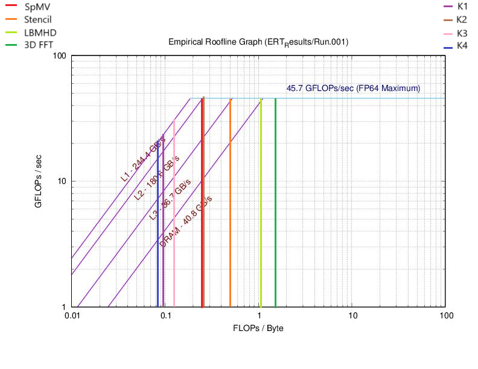

# Project 1
## Part 0: Warmup

Review the section in [HPSC](https://cmse822.github.io/assets/EijkhoutIntroToHPC2020.pdf) on computing arithmetic intensity for given compute kernels. Then, as a group, compute the arithmetic intensities of the following kernels in units of FLOPs/byte, assuming 8 bytes per float.

Include a table in your project report listing the arithmetic intensities for these kernels.

```
Y[j] += Y[j] + A[j][i] * B[i]
```

Arithmetic Intensity:  
$$
\frac{f(n)}{n} = \frac{3}{(4 \times 8)} = \frac{3}{32}
$$

```
s += A[i] * A[i]
```

Arithmetic Intensity:  
$$
\frac{f(n)}{n} = \frac{2}{(1 \times 8)} = \frac{1}{4}
$$

```
s += A[i] * B[i]
```

Arithmetic Intensity:  
$$
\frac{f(n)}{n} = \frac{2}{(2 \times 8)} = \frac{1}{8}
$$

```
Y[i] = A[i] + C * B[i]
```

Arithmetic Intensity:  
$$
\frac{f(n)}{n} = \frac{2}{(3 \times 8)} = \frac{1}{12}
$$

### Table of Arithmetic Intensities

| Kernel                          | Arithmetic Intensity (FLOPs/byte) |
|---------------------------------|-----------------------------------|
| `Y[j] += Y[j] + A[j][i] * B[i]` | $\frac{3}{32}$                    |
| `s += A[i] * A[i]`              | $\frac{1}{4}$                     |
| `s += A[i] * B[i]`              | $\frac{1}{8}$                     |
| `Y[i] = A[i] + C * B[i]`        | $\frac{1}{12}$                    |

___________________________________________________

## Part 1: Roofline Model
In this part, you will explore the roofline model for analyzing the interplay between arithmetic intensity and memory bandwidth for architectures with complex memory hierarchies. Complete the following exercises on the SAME compute architectures that you used in Part 1 above

Run the ERT in serial mode on at least 3 different node types on HPCC. Report the peak performances and bandwidths (for all caches levels as well as DRAM). Where is the "ridge point" of the roofline for the various cases?

Consider the four FP kernels in "Roofline: An Insightful Visual Performance Model for Floating-Point Programs and Multicore Architectures" (see their Table 2). Assuming the high end of operational (i.e., "arithmetic") intensity, how would these kernels perform on the platforms you are testing? What optimization strategy would you recommend to increase performance of these kernels?


**Roofline Plots**

amd-20


intel-16


intel-16-k80


intel-18



**Analysis:**

The arithmetic intensity of the Sparse Matrix Vector operation (SpMV) is 0.25. The operation consists of a dot product of each row of $ M $ ($ m \times n $) with $ x $ ($ n \times 1 $), totaling $ 2mn $ operations. It requires accessing $ M $ ($ mn $ elements), $ x $ ($ mn $ elements due to multiple accesses per row), and writing $ y $ ($ m $ elements), resulting in a total memory traffic of approximately $ 8mn $ bytes and an intensity of $ \frac{2mn}{8mn} = \frac{1}{4} $ FLOPs/byte. It is plotted in red line on the roofline models of HPC's four machines, showing that for each, it is memory/bandwidth bound and far from peak performance. For intel16 and intel18, it is even bounded by L3-cache traffic. To optimize, we can improve data locality using cache blocking, use vectorized operations, exploit sparsity patterns with compressed storage (e.g., CSR format), and leverage prefetching to reduce memory latency.

The arithmetic intensity of the stencil operation is approximately 0.5 FLOPs/byte. This value arises because each grid point update involves 7 neighboring points, leading to 8 FLOPs (typically a weighted sum: 7 additions and 1 multiplication). However, for a 3D grid, data reuse is limited, and each point must be reloaded from memory due to limited cache capacity. Each grid point requires loading 8 values (input and neighbors) and writing 1 output, totaling 9 memory accesses (assuming no reuse across timesteps). With 8 FLOPs per update, the intensity is $ \frac{8}{16} = 0.5 $ FLOPs/byte. Roofline analysis for each of the 4 machines suggests that it is better than SpMV in performance but it remains DRAM-bound. To optimize, we can improve spatial and temporal locality using cache-blocking techniques, implement loop fusion to reduce memory traffic, and apply software prefetching to enhance data reuse across timesteps.

The arithmetic intensity of the LBMHD kernel is approximately 1.07 FLOPs/byte. As a structured grid code, it involves iterative time-stepping where each update depends on neighboring grid points, leading to significant memory traffic. The roofline model analysis indicates that it is compute-bound on amd20 and intel16-k80 but still memory-bound on the intel16 and intel18 platforms. To optimize, we can exploit vectorization and FMA (fused multiply-add) operations to maximize computational efficiency on compute-bound architectures, while for memory-bound cases, improving cache blocking, reducing memory latency through prefetching, and optimizing data layout for better locality can enhance performance.   

The arithmetic intensity of the 3D FFT ranges from 1.09 to 1.64 FLOPs/byte, depending on problem size (128³ vs. 512³). FFT involves a series of global memory accesses and computationally expensive matrix transpositions, leading to varied intensity. The roofline model shows that due to the very high arithmetic intensity of FFT, it is limited by the compute resources available. To optimize, we can increase parallelism by exploiting multi-threading and vectorization, utilize FFT-specific hardware acceleration (e.g., GPU-accelerated FFT libraries like cuFFT), and reduce communication overhead in distributed FFT computations.

## Part 3: Agoge

**Sod Shock Tube Problem**

With the default parameters of SodShockTube experiment, it finishes in around 233ms. Following is the code generated performance report.

| Timer Name       | Total Time (s) | Calls | Avg (ms) | Mega Zone Updates/s |
|------------------|----------------|-------|----------|---------------------|
| main             | 0.233031       | 1     | 233.031  | 2.02                |
| timeLoop         | 0.212184       | 1     | 212.184  | 2.22                |
| EulerSolve       | 0.204319       | 919   | 0.222    | 2.30                |
| computeL         | 0.159094       | 1838  | 0.087    | 2.96                |

The following plot is generated through the visualization script.


### Modifying the dimension resolution
Doubling the spacing in `x` increasing the eulersolve and compute time by a factor of 6. The zone updates are reduced by 0.67. The output plot looks a little more stable than the previous one.

| Timer Name       | Total Time (s) | Calls | Avg (ms) | Mega Zone Updates/s |
|------------------|----------------|-------|----------|---------------------|
|main|                          1.230211         |1  |1230.211110            |1.55
|timeLoop|                      1.211302         |1  |1211.301987            |1.58
|EulerSolve|                    1.183481      |1867     |0.633895            |1.62
|computeL|                      0.651021|      3734|     0.174349|            2.94

Adding 512 number of steps in both `nx` and `ny` increases the computational load so much that the eulersolve and computeL take 180s and 84s to complete respectively. Setting `nx=ny=nz=512` is extremely slow and time wasn't reported.

If nx=ny=nz, and their values  versus total time is plotted, we see that the time scales should scale linearly eventually because Euler finite difference solver is O(n). However, to notice the trend, it requires larger values of n to be plotted which wasn't possible due to dev-node time constraints. Following is the graph.


### Modifying the time step

Increasing the `cfl` parameter reduces the execution time very fast because it controls the number of time steps. Decreasing it makes the experiment slower. The default parameter 0.1 results in 1000 steps. Bringing it to 0.001 increases the number of steps to around 10000 with the total time being 21s. Zone updates stay the same.


### Enabling/Disabling Gravity
Gravity has a huge impact on time because enabling it by setting `use_gravity: true` adds an additional poisson solver step. Eulersolve and computeL roughly take the same amount of time as without gravity by the poisson solver takes additional 14-15s.

### Modifying Sound Crossings
Increasing `sound_crossings` increases both the eulersolve and computeL time. There is not a significant effect on zone updates/s.

**Gravity Collapse Problem**

Vtune analysis was performed and DP GFLOPS, DRAM and AI values were reported for various input sizes.

### Euler Solver (FD)
| size | DP GFLOPS | DRAM, GB/sec | Arithmetic Intensity |
|------|-----------|-------------|----------------------|
| 32   | 2.217     | 6.524       | 0.339822195         |
| 64   | 2.128     | 6.853       | 0.31052094          |
| 128  | 1.879     | 5.75        | 0.326782609         |
| 256  | 1.975     | 6.08        | 0.324835526         |
| 512  | 1.962     | 5.792       | 0.338743094         |

### Gravity Solver (FFT)
| size | DP GFLOPS | DRAM, GB/sec | Arithmetic Intensity |
|------|-----------|-------------|----------------------|
| 32   | 4.92      | 0.008       | 615                  |
| 64   | 5.095     | 0.222       | 22.95045045          |
| 128  | 4.278     | 2.672       | 1.601047904          |
| 256  | 2.994     | 2.334       | 1.28277635           |
| 512  | 2.457     | 2.552       | 0.962774295          |
S

Following show the plot of arithmetic intensity as the input size increases. The y-axis, AI, is in logarithmic scale.


Here is the AI vs Peak flop rate plotted on intel-18 roofline model.

