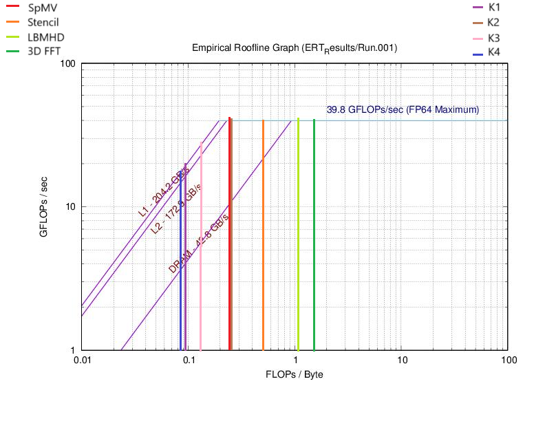
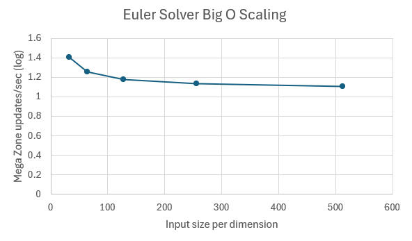

# Project 1
## Part 0: Warmup

Review the section in [HPSC](https://cmse822.github.io/assets/EijkhoutIntroToHPC2020.pdf) on computing arithmetic intensity for given compute kernels. Then, as a group, compute the arithmetic intensities of the following kernels in units of FLOPs/byte, assuming 8 bytes per float.

Include a table in your project report listing the arithmetic intensities for these kernels.

```
Y[j] += Y[j] + A[j][i] * B[i]
```

Arithmetic Intensity:  
$$
\frac{f(n)}{n} = \frac{3}{(4 \times 8)} = \frac{3}{32}
$$

```
s += A[i] * A[i]
```

Arithmetic Intensity:  
$$
\frac{f(n)}{n} = \frac{2}{(1 \times 8)} = \frac{1}{4}
$$

```
s += A[i] * B[i]
```

Arithmetic Intensity:  
$$
\frac{f(n)}{n} = \frac{2}{(2 \times 8)} = \frac{1}{8}
$$

```
Y[i] = A[i] + C * B[i]
```

Arithmetic Intensity:  
$$
\frac{f(n)}{n} = \frac{2}{(3 \times 8)} = \frac{1}{12}
$$

### Table of Arithmetic Intensities

| Kernel                          | Arithmetic Intensity (FLOPs/byte) |
|---------------------------------|-----------------------------------|
| `Y[j] += Y[j] + A[j][i] * B[i]` | $\frac{3}{32}$                    |
| `s += A[i] * A[i]`              | $\frac{1}{4}$                     |
| `s += A[i] * B[i]`              | $\frac{1}{8}$                     |
| `Y[i] = A[i] + C * B[i]`        | $\frac{1}{12}$                    |

___________________________________________________

## Part 1: Roofline Model
In this part, you will explore the roofline model for analyzing the interplay between arithmetic intensity and memory bandwidth for architectures with complex memory hierarchies. Complete the following exercises on the SAME compute architectures that you used in Part 1 above

Run the ERT in serial mode on at least 3 different node types on HPCC. Report the peak performances and bandwidths (for all caches levels as well as DRAM). Where is the "ridge point" of the roofline for the various cases?

Consider the four FP kernels in "Roofline: An Insightful Visual Performance Model for Floating-Point Programs and Multicore Architectures" (see their Table 2). Assuming the high end of operational (i.e., "arithmetic") intensity, how would these kernels perform on the platforms you are testing? What optimization strategy would you recommend to increase performance of these kernels?


### Roofline Plots

Following are the roofline plots for amd20, intel16 and intel18 machines. We report bandwidth for each memory type, the peak performance and the ridge point (where the system transitions from being memory-bound to compute-bound). On each plot, we have overlaid the four dwarfs kernels and the warmup kernels to understand their behaviour on these machines.

**Machine: amd-20**

| Component         | Bandwidth / Performance |
|------------------|-----------------------|
| L1 Bandwidth    | 204.2 GB/s            |
| L2 Bandwidth    | 172.9 GB/s            |
| DRAM Bandwidth  | 42.8 GB/s             |
| Peak Performance | 39.8 GFLOPs/s         |
| Ridge Point     | 0.929906 FLOPs/Byte   |




**Machine: intel-16**

| Component         | Bandwidth / Performance |
|------------------|-----------------------|
| L1 Bandwidth    | 200.8 GB/s            |
| L2 Bandwidth    | 129.7 GB/s            |
| L3 Bandwidth    | 79.2 GB/s             |
| DRAM Bandwidth  | 27.9 GB/s             |
| Peak Performance | 35.4 GFLOPs/s         |
| Ridge Point     | 1.268817 FLOPs/Byte   |


**Machine: intel-18**

| Component         | Bandwidth / Performance |
|------------------|-----------------------|
| L1 Bandwidth    | 244.4 GB/s            |
| L2 Bandwidth    | 180.6 GB/s            |
| L3 Bandwidth    | 86.7 GB/s             |
| DRAM Bandwidth  | 40.8 GB/s             |
| Peak Performance | 45.7 GFLOPs/s         |
| Ridge Point     | 1.12009 FLOPs/Byte    |


### Analysis


The arithmetic intensity of the Sparse Matrix Vector operation (SpMV) is 0.25. It consists of a dot product of each row of $ M $ ($ m \times n $) with $ x $ ($ n \times 1 $), totaling $ 2mn $ operations. Accessing $ M $ ($ mn $ elements), $ x $ ($ mn $ elements due to multiple accesses per row), and writing $ y $ ($ m $ elements) results in approximately $ 8mn $ bytes of memory traffic, giving an intensity of $ \frac{2mn}{8mn} = \frac{1}{4} $ FLOPs/byte. Roofline models show that SpMV is memory/bandwidth bound across HPC's four machines, with intel16 and intel18 further constrained by L3-cache traffic.  

The arithmetic intensity of the stencil operation is approximately 0.5 FLOPs/byte. Each grid point update involves 7 neighboring points, leading to 8 FLOPs (7 additions, 1 multiplication). In a 3D grid, limited cache capacity reduces data reuse, requiring each point to be reloaded, resulting in 9 memory accesses per update. With 8 FLOPs per update, the intensity is $ \frac{8}{16} = 0.5 $ FLOPs/byte. Roofline analysis indicates better performance than SpMV but still DRAM-bound.  

The arithmetic intensity of the LBMHD kernel is about 1.07 FLOPs/byte. As a structured grid code with iterative time-stepping, it has significant memory traffic. Roofline models show it is compute-bound on amd20 and intel16-k80 but memory-bound on intel16 and intel18.  

The arithmetic intensity of the 3D FFT ranges from 1.09 to 1.64 FLOPs/byte, depending on problem size (128³ vs. 512³). FFT involves frequent global memory accesses and computationally expensive transpositions, making it compute-limited in the roofline model.  

The four arithmetic kernels have very low intensity, all below 1, making them highly memory-bound on each machine. Roofline models suggest they perform poorly on all machines due to bandwidth constraints, with no significant compute bottlenecks.

**Optimizations:**  
For SpMV, improving data locality via cache blocking, vectorized operations, compressed storage (CSR format), and prefetching can reduce memory latency. Stencil computations benefit from cache-blocking, loop fusion, and software prefetching for better data reuse. LBMHD optimization includes vectorization, FMA operations for compute-bound cases, and cache blocking plus memory latency reduction for memory-bound cases. FFT performance can be enhanced through multi-threading, vectorization, FFT-specific hardware acceleration (e.g., cuFFT), and reducing communication overhead in distributed settings. For the arithmetic kernels, optimizations could include cache blocking, loop unrolling, vectorization, prefetching, and memory alignment.

## Part 3: Agoge

### Exploring the Sod Shock Tube Problem

With the default parameters of SodShockTube experiment, it finishes in around 233ms. Following is the code generated performance report.

| Timer Name       | Total Time (s) | Calls | Avg (ms) | Mega Zone Updates/s |
|------------------|----------------|-------|----------|---------------------|
| main             | 0.233031       | 1     | 233.031  | 2.02                |
| timeLoop         | 0.212184       | 1     | 212.184  | 2.22                |
| EulerSolve       | 0.204319       | 919   | 0.222    | 2.30                |
| computeL         | 0.159094       | 1838  | 0.087    | 2.96                |

The following plot is generated through the visualization script.


**Modifying the dimension resolution**
Doubling the spacing in `x` increasing the eulersolve and compute time by a factor of 6. The zone updates are reduced by 0.67. The output plot looks a little more stable than the previous one.

| Timer Name       | Total Time (s) | Calls | Avg (ms) | Mega Zone Updates/s |
|------------------|----------------|-------|----------|---------------------|
|main|                          1.230211         |1  |1230.211110            |1.55
|timeLoop|                      1.211302         |1  |1211.301987            |1.58
|EulerSolve|                    1.183481      |1867     |0.633895            |1.62
|computeL|                      0.651021|      3734|     0.174349|            2.94

Adding 512 number of steps in both `nx` and `ny` increases the computational load so much that the eulersolve and computeL take 180s and 84s to complete respectively. Setting `nx=ny=nz=512` is extremely slow and time wasn't reported.

If nx=ny=nz, and their values  versus total time is plotted, we see that the time scales should scale linearly eventually because Euler finite difference solver is O(n). However, to notice the trend, it requires larger values of n to be plotted which wasn't possible due to dev-node time constraints. Following is the graph.


**Modifying the time step**

Increasing the `cfl` parameter reduces the execution time very fast because it controls the number of time steps. Decreasing it makes the experiment slower. The default parameter 0.1 results in 1000 steps. Bringing it to 0.001 increases the number of steps to around 10000 with the total time being 21s. Zone updates stay the same.


**Enabling/Disabling Gravity**
Gravity has a huge impact on time because enabling it by setting `use_gravity: true` adds an additional poisson solver step. Eulersolve and computeL roughly take the same amount of time as without gravity by the poisson solver takes additional 14-15s.

**Modifying Sound Crossings**
Increasing `sound_crossings` increases both the eulersolve and computeL time. There is not a significant effect on zone updates/s.

### Gravity Collapse Problem

Vtune analysis was performed and DP GFLOPS, DRAM and AI values are reported for various input sizes.

### Euler Solver (FD)
| size | DP GFLOPS | DRAM, GB/sec | Arithmetic Intensity | Mega Zone updates/sec |
|------|-----------|-------------|----------------------|-|
| 32   | 2.217     | 6.524       | 0.339822195         | 4.69 |
| 64   | 2.128     | 6.853       | 0.31052094          | 3.97 |
| 128  | 1.879     | 5.75        | 0.326782609         | 3.64 |
| 256  | 1.975     | 6.08        | 0.324835526         | 3.48 |
| 512  | 1.962     | 5.792       | 0.338743094         | 3.36 |

### Gravity Solver (FFT)
| size | DP GFLOPS | DRAM, GB/sec | Arithmetic Intensity |Zone updates/sec|
|------|-----------|-------------|----------------------|-|
| 32   | 4.92      | 0.008       | 615                  | 10.8 |
| 64   | 5.095     | 0.222       | 22.95045045          | 9.41 |
| 128  | 4.278     | 2.672       | 1.601047904          | 7.28|
| 256  | 2.994     | 2.334       | 1.28277635           | 5.84|
| 512  | 2.457     | 2.552       | 0.962774295          | 4.1 |


To estimate the Big-O scaling, we show the following plot of zone updates per second as the input size increases. The y-axis, mega zone updates per second, is in logarithmic  $\log_3$ scale. The x-axis is input size per dimension.


For the Euler solver, which is a finite difference solver, we observe that the trend converges to a constant line. This happens because the zone updates scale linearly with the input size. As the grid size increases, the number of updates per grid point remains roughly the same, leading to a flat line in the plot. This flat line indicates that the ratio of zone updates to input size is a constant, reflecting linear scaling with respect to the input size.


For the Gravity solver, we see that the trend initially decreases but eventually flattens out. This behavior occurs because the FFT algorithm has a time complexity of $O(N\log N)$, where N is the number of grid points. As the grid size increases, the FFT solver becomes more efficient relative to its input size, and the growth rate of the number of operations slows down. The flattening trend in the plot indicates that, for larger grid sizes, the solver's performance is more efficient, leading to fewer operations per zone update as the grid size grows. However, the scaling is not linear due to the logarithmic factor in the time complexity, which causes the decrease in zone updates per second.


Here is the AI vs Peak flop rate plotted on intel-18 roofline model.


The points evaluating on a 32^3 grid are very jittery, so they cannot be fully relied upon. However, the far-right point for the Gravity Solver at the  32^3 grid size indicates a very high arithmetic intensity, likely because the input size fits in the cache and the solver’s memory access patterns may not be properly detected by VTune.

The plot also shows that the Gravity Solver is positioned further right than the Euler Solver, suggesting that the Gravity Solver is more compute-bound. This is due to its higher arithmetic intensity, implying that the solver is utilizing more computational resources relative to memory bandwidth.